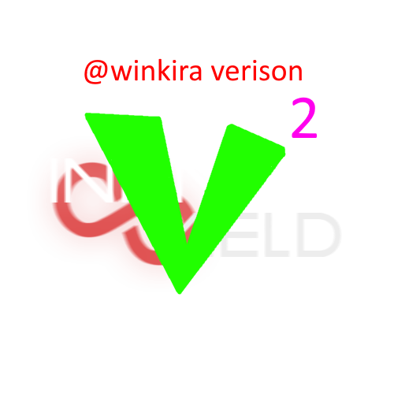

# InfiniteYieldV2

**InfiniteYieldV2** is a modern, fully revamped continuation of the original **Infinite Yield**, focused on cleaner architecture, improved usability, and stronger compatibility with modern Roblox games.

This project is **not affiliated with the original Infinite Yield**, but exists as a community-driven evolution built with respect for the original work.

Huge credit to the original creator of **Infinite Yield** for laying the foundation.

Developed and maintained by **winkira**  
Discord: `winkira`  
GitHub: `kirahhkimmm`

---

## 🚀 Project Goals

InfiniteYieldV2 aims to go beyond a simple command script and evolve into a **powerful, extensible admin framework** with a modern feel.

Planned and in-progress features include:

- ⚡ **Improved compatibility** with games that use heavier anti-cheat systems  
- 🧠 **Refactored command system** (modular, cleaner, easier to extend)
- 🖥️ **Redesigned console** with better logging, filtering, and readability
- 🎨 **Modern UI overhaul** (faster, cleaner, more responsive)
- 🧩 **Open-source modular structure** for easy contributions and forks
- 🔧 Better performance and stability compared to legacy versions

> ⚠️ Note: This project is **actively in development**. Not all features are finished yet.

---

## 🖼️ Logo

 

---

## 🤝 Contributing

InfiniteYieldV2 is **open source**, and contributors are welcome.

We are specifically looking for help with:
- UI/UX design
- Command/module development
- Code optimization & refactoring
- Testing across different games
- Documentation

If you’re interested in helping, feel free to:
- Open a pull request
- Submit issues or feature ideas
- Reach out on Discord

---

## 📌 Disclaimer

This project is for **educational and experimental purposes**.  
Use responsibly and at your own risk.

---

**InfiniteYieldV2** — taking a classic further, the right way.
